# CharacterGAN

Implementation of the paper [*"CharacterGAN: Few-Shot Keypoint Character Animation and Reposing"* by Tobias Hinz, Matthew Fisher, Oliver Wang, Eli Shechtman, and Stefan Wermter](google.com) (open with Adobe Acrobat or similar to see visualizations). Supplementary material can be found [here](google.com).

Our model can be trained on only a *few images (e.g. 10) of a given character* labeled with user-chosen *keypoints*.
The resulting model can be used to *animate* the character on which it was trained by interpolating between its poses specified by their keypoints.
We can also *repose* characters by simply moving the keypoints into the desired positions.
To train the model all we need are few images depicting the character in diverse poses from the same viewpoint, keypoints, and a file that describes how the keypoints are connected (the characters *skeleton*).

### Examples

**Animation**: For all examples the model was trained on 8-15 images (see first row) of the given character.

Training Images |  12         |  15          |  9         |  12          |  15         |  15          |  8
:-------------------------:|:-------------------------:|:-------------------------:|:-------------------------:|:-------------------------:|:-------------------------:|:-------------------------:|:-------------------------:
Animation |  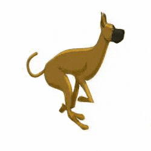 |  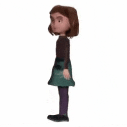 |  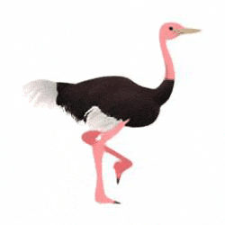 |  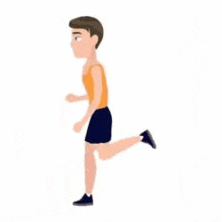 |   |   |  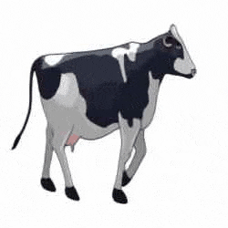

**Frame interpolation**: Example of interpolations between two poses with the start and end keypoints highlighted:

 |  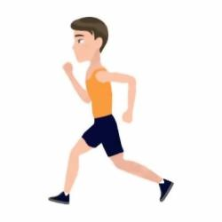 |   |   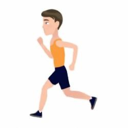 |   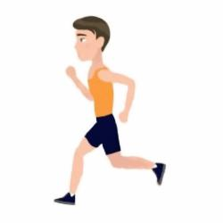 |   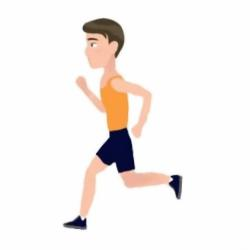 |    |   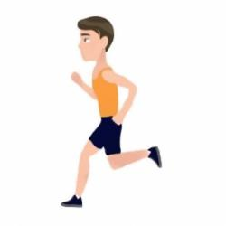 |   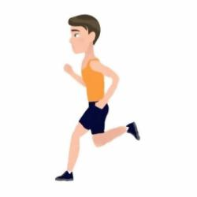 |   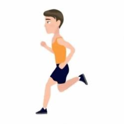 |    |  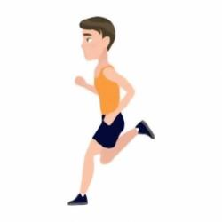  |   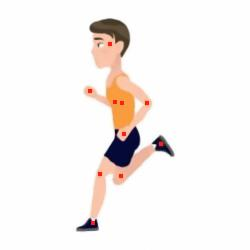
:-------------------------:|:-------------------------:|:-------------------------:|:-------------------------:|:-------------------------:|:-------------------------:|:-------------------------:|:-------------------------:|:-------------------------:|:-------------------------:|:-------------------------:|:-------------------------:|:-------------------------:
 |   |   |   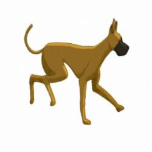 |    |   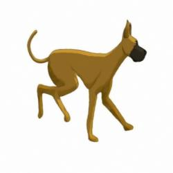 |   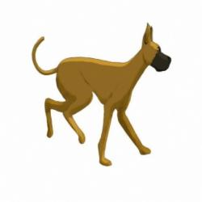 |    |   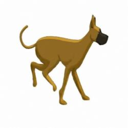 |    |    |    |   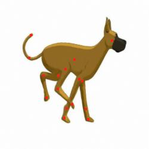

**Reposing**: You can use our interactive GUI to easily repose a given character based on keypoints.
TODO

## Installation

- python 3.8
- pytorch 1.7.1

```
pip install -r requirements.txt
```

## Training

### Training Data
All training data for a given character should be in a single folder.
Concretely: the folder should contain all training images (all in the same resolution), a file called `keypoints.csv`, and (potentially) a file called `keypoints_skeleton.csv`. We used [this website](https://www.makesense.ai/) to label our images but there are of course other possibilities.

The structure of the `keypoints.csv` file is (no header): `keypoint_label,x_coord,y_coord,file_name`.
The first column describes the keypoint label (e.g. *head*), the next two columns give the location of the keypoint, and the final column states which training image this keypoint belongs to.

The structure of the `keypoints_skeleton.csv` file is (no header): `keypoint,connected_keypoint,connected_keypoint,...`.
The first column describes which keypoint we are describing in this line, the following columns describe which keypoints are connected to that keypoint (e.g. *elbow, shoulder, hand* would state that the *elbow* keypoint should be connected to the *shoulder* keypoint and the *hand* keypoint).

See our example training data in `datasets` for examples of both files.

### Train a Model
To train a model with the default parameters from our paper run:

```
python train.py --gpu_ids 0 --num_keypoints 16 --dataroot datasets/Dog --fp16
```

Training one model should take about 60 (FP16) to 90 (FP32) minutes on an NVIDIA GeForce GTX 2080Ti.

### Training Parameters
You can adjust several parameters at train time to possibly improve your results.

* `--name` to change the name of the folder in which the results are stored (default is `CharacterGAN-Timestamp`
* `--niter 4000` and `--niter_decay 4000` to adjust the number of training steps (`niter_decay`is the number of training steps during which we reduce the learning rate linearly; default is 8000 for both, but you can get good results with fewer iterations)
* `--mask False --output_nc 3` to train without a mask
* `--skeleton False`to train without skeleton information
* `--bkg_color 0` to set the background color of the training images to *black* (default is white, only important if you train with a mask)
* `--batch_size 10` to train with a different batch size (default is 5)

The file `options/keypoints.py` lets you modify/add/remove keypoints for your characters.

### Results
The output is saved to `checkpoints/` and we log the training process with Tensorboard.
To monitor the progress go to the respective folder and run

```
 tensorboard --logdir .
```

# Testing
At test time you can either use the model to animate the character or use our interactive GUI to change the position of individual keypoints.

### Animate Character
animate

```
python animate_example.py --gpu_ids 0 --model_path checkpoints/Dog-.../ --img_animation_list datasets/Dog/animation_list.txt --dataroot datasets/Dog
```

`--img_animation_list` points to a file that lists the images that should be used for animation. The file should contain one file name per line pointing to an image in `dataroot`. The model then generates an animation by interpolating between the images in the given order. See `datasets/Dog/animation_list.txt` for an example.

You can add `--draw_kps` to visualize the keypoints in the animation.
You can specifiy the gif parameters by setting `--num_interpolations 10` and `--fps 5`.
`num_interpolations` specifies how many images are generated between two real images (from `img_animation_list`), `fps` determines the frames per second of the generated gif.

### Modify Individual Keypoints
To run the interactive GUI:

```
python visualizer.py --gpu_ids 0 --model_path checkpoints/Dog-.../
```

Set `--gpu_ids -1` to run the model on a CPU.
You can also scale the images during visualization, e.g. use `--scale 2`.

## Patch-based refinement
We use [this implementation](https://github.com/jamriska/ebsynth) to run the patch-based refinement step on our generated images.
The easiest way to do this is to merge all your training images into a single large image file and use this image file as the style and source image.

## Acknowledgements
Our implementation uses code from [Pix2PixHD](https://github.com/NVIDIA/pix2pixHD), the TPS augmentation from [DeepSIM](https://github.com/eliahuhorwitz/DeepSIM), and the patch-based refinement code from [https://ebsynth.com/](https://ebsynth.com/) ([GitHub](https://github.com/jamriska/ebsynth)).

## Citation
If you found this code useful please consider citing:

```
@article{hinz2021improved,
    author    = {Hinz, Tobias and Fisher, Matthew and Wang, Oliver and Shechtman, Eli and Wermter, Stefan},
    title     = {CharacterGAN: Few-Shot Keypoint Character Animation and Reposing},
    journal = {ArXiV},
    year      = {2021}
}
```
