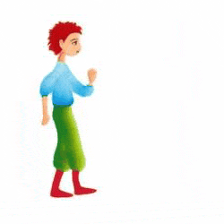
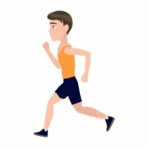
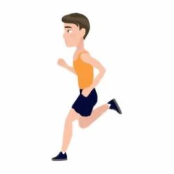
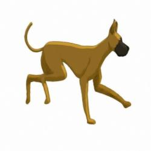
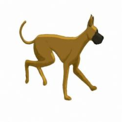
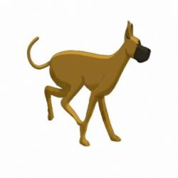

# CharacterGAN

Implementation of the paper [*"CharacterGAN: Few-Shot Keypoint Character Animation and Reposing"* by Tobias Hinz, Matthew Fisher, Oliver Wang, Eli Shechtman, and Stefan Wermter](google.com) (open with Adobe Acrobat or similar to see visualizations). Supplementary material can be found [here](google.com).

Our model can be trained on only a *few images (e.g. 10) of a given character* labeled with user-chosen *keypoints*.
The resulting model can be used to *animate* the character on which it was trained by interpolating between its poses specified by their keypoints.
We can also *repose* characters by simply moving the keypoints into the desired positions.
To train the model all we need are few images depicting the character in diverse poses from the same viewpoint, keypoints, and a file that describes how the keypoints are connected (the characters *skeleton*).

### Examples

**Animation**: For all examples the model was trained on 8-15 images (see first row) of the given character.

Training Images |  12         |  15          |  9         |  12          |  15         |  15          |  8
:-------------------------:|:-------------------------:|:-------------------------:|:-------------------------:|:-------------------------:|:-------------------------:|:-------------------------:|:-------------------------:
Animation |   |   |   |   |   |   |  

**Frame interpolation**: Example of interpolations between two poses with the start and end keypoints highlighted:

 |   |   |    |    |    |    |    |    |    |    |    |   
:-------------------------:|:-------------------------:|:-------------------------:|:-------------------------:|:-------------------------:|:-------------------------:|:-------------------------:|:-------------------------:|:-------------------------:|:-------------------------:|:-------------------------:|:-------------------------:|:-------------------------:
 |   |   |    |    |    |    |    |    |    |    |    |   

**Reposing**: You can use our interactive GUI to easily repose a given character based on keypoints.

## Installation

- python 3.8
- pytorch 1.7.1

```
pip install -r requirements.txt
```

## Requirements
Images (we do 250px, larger possible I guess)
Keypoints
Skeleton

## Training

### Training Data
All training data for a given character should be in a single folder.
Concretely: the folder should contain all training images (all in the same resolution), a file called `keypoints.csv`, and (potentially) a file called `keypoints_skeleton.csv`.


To train a model with the default parameters from our paper run:

```
python train.py --gpu_ids 0 
```

Training one model should take about 60 (FP16) to 80 (FP32) minutes on an NVIDIA GeForce GTX 2080Ti.

### Parameters to Modify
image size
mask


```
python train.py --gpu_ids 0
```


### Results
The output is saved to `checkpoints/` and we log the training process with Tensorboard.
To monitor the progress go to the respective folder and run

```
 tensorboard --logdir .
```

# Testing
At test time you can either use the model to animate the character or use our interactive GUI to change the position of individual keypoints.

### Animate Character
animate

```
python 
```


### Modify Individual Keypoints
GUI

```
python 
```


## Patch-based refinement
use PM

## Acknowledgements
Our implementation uses code from [Pix2PixHD](google.com) and the TPS augmentation from [DeepSIM](google.com).

## Citation
If you found this code useful please consider citing:

```
@article{hinz2021improved,
    author    = {Hinz, Tobias and Fisher, Matthew and Wang, Oliver and Shechtman, Eli and Wermter, Stefan},
    title     = {CharacterGAN: Few-Shot Keypoint Character Animation and Reposing},
    journal = {ArXiV},
    year      = {2021}
}
```
